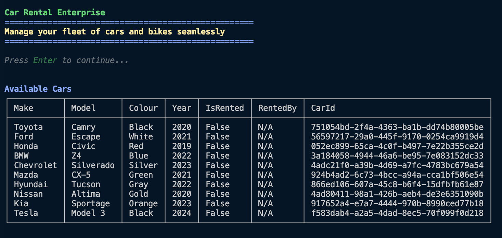

# Car Rental App - C# Console Application

**Overview**

**Car Rental App** is a console-based application built in **C#** to consolidate my understanding of C# fundamentals. The application is designed for a car rental business manager to handle various operations like tracking rentals, managing customers, and viewing vehicle inventory in a structured and user-friendly console interface using **Spectre.Console**.

---

## **Features**

- **Manage Customers:** Add and remove customers.
- **Manage Rentals:** Rent and return cars and bikes.
- **View Inventory:** Display all cars and bikes, filter by availability.
- **Data Simulation:** Pre-seeded customer and vehicle data for testing.

---



---

## **Concepts and Techniques Used:**

- Object-Oriented Programming (OOP)
- Generics
- LINQ (Method and Query syntax)
- Exception Handling
- Dependency Injection
- Interfaces
- Collections (Lists)
- Data Seeding
- Console UI using Spectre.Console

---

## **Getting Started**

### **Prerequisites:**

- .NET SDK installed
- Git installed

### **Clone the repository:**

```bash
$ git clone https://github.com/yourusername/car-rental-app.git
```

### **Navigate to the project directory:**

```bash
$ cd car-rental-app
```

### **Build the application:**

```bash
$ dotnet build
```

### **Run the application:**

```bash
$ dotnet run
```

---

## **Usage:**

1. Start the application and follow the prompts to manage rentals and customers.
2. Use the main menu to select between Customer Operations, Vehicle Display Options, and Rental Operations.
3. View and manage rental items through tables and selection prompts.
